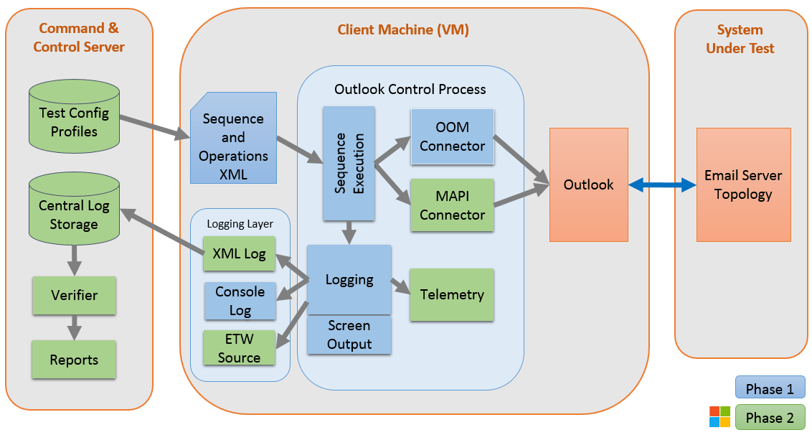

# MailSim User Guide

### Table of Contents
- [Overview](#overview)

- [Change History](#change-history)

- [Prerequisites](#prerequisites)

- [Setting up MailSim](#setting-up-mailsim)

- [Executing MailSim](#executing-mailsim)

- [MailSim operations](#mailsim-operations)

- [Debugging output](#debugging-output)

- [Questions and comments](#questions-and-comments)

- [Additional resources](#additional-resources)

## Overview

MailSim (*Mail Simulator*) is a Microsoft Windows command-line tool that automates email operations in Microsoft Outlook 2013. MailSim reads user-defined XML configuration files and creates Outlook traffic, such as test email or folder operations. This test traffic is designed to exercise an Outlook-compatible email server in a multi-client environment for extended periods. During execution, MailSim displays client-side process messages, and also stores those messages in log files, for monitoring and troubleshooting.

There are three conceptual components in a MailSim test environment:

- The MailSim tool (MailSim.exe), which reads the input files and then controls

- An Outlook client on the same machine as MailSim, configured with a default email profile, which then interacts with

- An Outlook-compatible email server with a set of test user accounts and distribution lists.

This initial release of MailSim is shown as Phase 1 in [this architecture diagram](MailSim_Architecture_Diagram.png).



MailSim itself (the "Outlook Control Process") runs on a client machine with an instance of Outlook 2013. Given the input configuration files, MailSim calls Outlook to perform the email message and folder operations, and stores the MailSim process messages in a console log file. As shown in the diagram, Phase 2 will extend this logging to include XML log-based verification tools and reports.

There can be many client machines for a single email server.  The clients are independent and do not interact except through email – each Outlook client connects directly with the email server under test.

MailSim uses the Outlook Object Model (see [Additional resources](#additional-resources)) to execute operations on an Outlook instance. The operations are called in the order in which they are defined in the configuration files, and can be iterated with specified delays between iterations. All operations are repeatable, except those with randomly selected recipients or attachments. 

There are two types of MailSim XML input configuration files, one that defines individual test *operations*, such as sending a reply with an attachment, and one that defines *control sequences* for calling those operations, such as repeating the operation a number of times. The combination of an operation file and a sequence file is called a *test profile*. There can be many test profiles on one MailSim client, and test profiles can be different for each client. Each operation and sequence has configuration options for its name, type, duration, scale, order, format, and repetition – see [Creating MailSim test profiles](#creating-mailsim-test-profiles) and [MailSim operations](#mailsim-operations).

Here is an example operation and its control sequence:
```
(defined in myOperationsFile.xml)

<MailSend OperationName="OpMailSendToBob" Sleep="5">
  <Recipients>Bob TestUser</Recipients>
</MailSend>

(defined in mySequenceFile.xml)

<OperationGroup Name="SendBobMail5Times" 
    OperationFile="myOperationsFile.xml" 
    Iterations="5" 
    Sleep="120">
  <Task Name="OpMailSendToBob"/>
</OperationGroup>
```

The above example defines an operation `OpMailSendToBob` that sends one email to "Bob TestUser" and then waits 5 seconds for latency. In the operation group `SendBobMail5Times`, that operation is repeated 5 times, with two minutes’ delay in between repetitions.

### Change History

July 31 2015 - Initial release

## Prerequisites

To use MailSim, you will need the following:

- The MailSim package, which includes the executable and sample files

  *  You will need to create one or more test profiles, and optionally a set of test attachments – see Creating MailSim test profiles.

- A Microsoft Outlook 2013 client on the MailSim machine

  * The Outlook client should be configured with a default profile and connected to the email server under test – see Creating Outlook clients.

  * **Note:** The client must have [Microsoft .NET Framework version 4.5](http://www.microsoft.com/en-us/download/details.aspx?id=30653) installed.

- An Outlook-compatible email server

  * You will need to create a separate email environment for running MailSim, including a set of test users in the global address list and some distribution groups – see [Provisioning an Outlook-compatible email server](#provisioning-an-outlook-compatible-email-server).

  * **Note:**  Do not run MailSim operations in your regular email environment, as the generated traffic can be substantial.

## Setting up MailSim

Each of the three components of the MailSim test environment requires some setup, as described in the following sections:

* [Provisioning an Outlook-compatible email server](#provisioning-an-outlook-compatible-email-server)

* [Creating Outlook clients](#creating-outlook-clients)

* [Creating MailSim test profiles](#creating-mailsim-test-profiles)

### Provisioning an Outlook-compatible email server

The email server will need a set of test user accounts, and a set of associated distribution groups with varying numbers of test users. 

The number of test users and sizes of distribution groups should be configured to approximate the eventual real traffic expected in the production email environment.

### Creating Outlook clients

To create an Outlook client on the MailSim machine, you can either use an existing Outlook 2013 instance, or install Outlook 2013 (32-bit).

**Note:** [.NET 4.5](http://www.microsoft.com/en-us/download/details.aspx?id=30653) must also be installed on the client machine.

1. Create a new email profile on the client.

2. If the Outlook client has more than one profile, set the new email profile as the default profile:

  1. If Outlook is running, close it.

  2. Start Outlook.

  3. When the Choose Profile dialog appears, select the test email profile.

  4. Click Options, select Set as default profile, and then click OK.

### Creating MailSim test profiles

If needed in your environment, create a set of test attachment files on the MailSim machine. The files can be of any type and any size needed for a realistic simulation.

Define the traffic you want to generate by creating test profiles. Each profile is a combination of an operations file and a sequence file. The structure of these files is defined by Operations.xsd and Sequence.xsd, which are provided in the MailSim package. In the Samples subdirectory there are two corresponding example files, Operations.xml and Sequence.xml.

Operations.xsd defines all MailSim operations that can be used in a sequence file. 

* All operations have three common attributes: 

  * A unique OperationName.

  * A Count value specifying the number of times to repeat the operation.

  * An optional Sleep value specifying the number of seconds between repetitions. 

  * Each operation also has its own elements and attributes for specifying email recipients, distribution lists, attachments, folder locations, and so forth – see [MailSim operations](#mailsim-operations).

Sequence.xsd defines groups of operations as sequential sets of tasks. 

* Each OperationGroup has four attributes:

  * A unique Name.

  * A source OperationFile name.

  * An optional Iterations value specifying the number of times to iterate the operation group.

  * An optional Sleep value specifying the number of seconds between operation group iterations. 

* Similarly, each Task has a Name, an optional Iterations value specifying the number of times to iterate this task, and an optional Sleep value specifying the number of seconds between task iterations. 

* In addition, Sequence.xsd specifies an optional LogFileLocation directory, and optionally whether to disable the Outlook security prompt (DisableOutlookPrompt).

Note: Each Operation specifies its own optional Count value, and each Task and OperationGroup specifies its own optional Iterations value. For example, an Operation with a Count value of 2, a Task Iterations value of 3, and an OperationGroup Iterations value of 5 will be repeated 30 times in total, with any specified Sleep delays in between. If the Count and Iteration values are not specified, the default is 1.

## Executing MailSim

To run a sequence of operations using MailSim:

1. Open a Windows command window on the MailSim machine, by pressing the Windows button and entering cmd in the search box. 

2. Navigate to the MailSim configuration file directory on a local drive. 

3. Locate the desired sequence definition file, for example, TestSequence.xml.

4. Enter the following command: 

```
MailSim TestSequence.xml
```

The sequence’s process messages are displayed in the command window, and also saved to log files – see [Debugging output](#debugging-output).

## MailSim operations

MailSim supports the following operations:

* MailSend

* MailDelete

* MailReply

* MailForward

* MailMove

* FolderCreate

* FolderDelete

**Note:** Examples of each of these operations are shown in the Operations.xml file in the supplied Samples subdirectory.

### MailSend

The MailSend operation sends email to one or more recipients. Individual recipients can be specified by email address, alias, or display name. Alternately, one or more recipients can be randomly selected by MailSim from the global address book, or from a given distribution list. Each sent email can optionally include attachment files, either specified or randomly chosen.

To directly specify recipients, use one or more Recipients elements:

```
  <MailSend OperationName="OpMailSend" Sleep="7"> 
    <Recipients>Bob TestUser</Recipients> 
    <Recipients>Sally@Test.com</Recipients> 
    <Subject>Test subject</Subject> 
    <Body>Test body</Body> 
    <Attachment>C:\myAttachments\attach1.txt</Attachment>
    <Attachment>C:\myAttachments\attach2.txt</Attachment>
  </MailSend>
```

To choose random recipients instead, use the RandomRecipients element with a DistributionList:

```
  <MailSend OperationName="OpMailSendRandom" Sleep="7"> 
    <RandomRecipients DistributionList="MailSim Users">
      9
    </RandomRecipients>
    <Subject>Test subject</Subject> 
    <Body>Test body</Body> 
    <RandomAttachments Count="5">
      C:\myAttachments
    </RandomAttachments>
  </MailSend> 
```

Similarly, attachments are specified or randomly chosen using either the Attachments or RandomAttachments elements, as shown in the examples above. When using RandomAttachments, the element value is the attachment folder pathname.

**Note:** If the RandomRecipients element value is zero, or the RandomAttachments element’s Count value is zero, a random number of recipients or attachments are chosen, respectively.

### MailDelete

The MailDelete operation deletes emails from a given folder, up to a specified number (Count) of emails, and optionally only emails which have a specified string in the subject. If the Count value is zero, a random number of emails in the folder are deleted.

**Note:** At runtime, if there are fewer emails in the folder than the Count attribute value, MailSim reduces the Count value to the number of emails present in the folder and generates a warning message. For example, given the following operation definition, deleting 10 emails from the Inbox folder that have “Default Subject” in their subject lines:

```
<MailDelete OperationName="MailDeleteBySubjectOp" Count="10" Sleep="7">
    <Folder>olFolderInbox</Folder>
    <Subject>Default Subject</Subject>
</MailDelete>
```

In the above example, if there are only 3 emails currently in the Inbox folder, MailSim generates the following warning:
```
5/15/2016 3:55:24 PM Warning : MailDeleteBySubjectOp : Only 3 email(s) in the folder, adjusting the number of emails to delete from 10 to 3
```

### MailReply

The MailReply operation sends replies to a specified number (Count) of emails located in a given folder, optionally just those which have a specified string in the subject. If the MailReply Count is zero, replies are sent to a random number of emails. 

By default, each reply is sent only to the email originator; to change that behavior, set the optional ReplyAll attribute to true. 

Like [MailSend](#mailsend), the replies can include attachment files, either specified or randomly chosen. 
```
<MailReply OperationName="OpMailReply" 
    ReplyAll="true" 
    Count="9"> 
  <Folder>olFolderInbox</Folder> 
  <MailSubjectToReply>Subject string to match</MailSubjectToReply> 
  <ReplyBody>Reply body text</ReplyBody> 
</MailReply>
```

### MailForward

The MailForward operation forwards email messages located in a folder to one or more recipients, either specified or randomly chosen from the global address book or a distribution list. To forward only email containing a given string in the subject, set the optional MailSubjectToForward value to that string. 

```
<MailForward OperationName="OpMailForward" Count="1" Sleep="1"> 
  <Folder>olFolderInbox</Folder> 
  <Recipients>Sally TestUser</Recipients> 
  <MailSubjectToForward>Subject string to match</MailSubjectToForward> 
  <ForwardBody>Forwarding body text</ForwardBody> 
</MailForward>
```

Like [MailSend](#mailsend), recipients can be specified one by one or randomly, and the forwarded messages can include attachment files, also either specified or randomly chosen.

### MailMove

The MailMove operation moves emails from one folder to another, either all emails in the source folder or optionally only those having a specified string in the subject. If the MailMove Count is zero, a random number of emails are moved.

```
<MailMove OperationName="OpMailMove" Count="1" Sleep="1"> 
    <SourceFolder>olFolderInbox</SourceFolder> 
    <DestinationFolder>olFolderJunk</DestinationFolder> 
    <Subject>Subject string to match</Subject> 
</MailMove>
```

### FolderCreate

The FolderCreate operation creates a named subfolder under a pre-defined folder in Outlook. Each created subfolder name is prepended with the date and time of creation, for example, "2016-07-02 16-02-37 NewTestFolder".

```
<FolderCreate OperationName="OpFolderCreate" Count="10" Sleep="2"> 
    <FolderPath>olFolderInbox</FolderPath> 
    <FolderName>MyTestFolderName</FolderName> 
</FolderCreate>
```

The parent folder (FolderPath) must be one of the following: 

* olFolderInbox

* olFolderDrafts

* olFolderSentMail

* olFolderDeletedItems

* olFolderJunk

* olFolderOutbox

**Note:** To allow for latency, specify a Sleep time between FolderCreate operations.

### FolderDelete

The FolderDelete operation deletes subfolders, optionally with a specified string in their names, from under a pre-defined folder in Outlook. If Count is zero, a random number of subfolders are deleted.

```
<FolderDelete OperationName="OpFolderDelete" Count="10" Sleep="2"> 
    <FolderPath>olFolderInbox</FolderPath> 
    <FolderName>String to match</FolderName> 
</FolderDelete>
```

The parent folder (FolderPath) must be one of the following: 

* olFolderInbox

* olFolderDrafts

* olFolderSentMail

* olFolderDeletedItems

* olFolderJunk

* olFolderOutbox

**Note:** Like [MailDelete](#maildelete), if there are fewer subfolders at runtime than the Count attribute value, MailSim reduces the Count value to the number of subfolders present in the parent folder and generates a warning message. 

## Debugging output

While executing a sequence file, MailSim status messages are displayed in the Windows command window. In addition, each time a sequence runs, a log file is created to contain the same status messages in an XML wrapper – see [Log file output example](#log-file-output-example).

### Command window output example

For example, using the supplied sample Sequence.xml configuration file:

```
<OperationGroup Name="Multiple Runs with 5 iterations" 
    OperationFile="Operations.xml" 
    Iterations="5" 
    Sleep="120">
  <Task Name="MailSendToMyself" Sleep="10"/>
. . .
</OperationGroup>
```

Where the task is defined in the sample Operations.xml as:
```
  <MailSend OperationName="MailSendToMyself" Sleep="5">
    <Recipients>Joe</Recipients>
  </MailSend>
```

Status messages are similar to the following listing. In this case, "Joe" is not recognized as a user name and so an error is generated (in red in the command window):

```
C:\MailSimTest> MailSim Sequence.xml

7/22/2016 10:05:05 AM Info      : Connection    : Connecting to an existing Outlook instance
7/22/2016 10:05:05 AM Info      : DefaultInboxMonitor   : Registered event to \\TestUser@TestServer \Inbox
7/22/2016 10:05:05 AM Info      : Multiple Runs with 5 iterations       : Starting group run 1
7/22/2016 10:05:05 AM Info      : MailSendToMyself      : Running task 1
7/22/2016 10:05:05 AM Info      : MailSendToMyself      : Subject: 7/22/2016 10:05:05 AM - Default Subject
7/22/2016 10:05:05 AM Info      : MailSendToMyself      : Body: 7/22/2016 10:05:05 AM - Default Body

7/22/2016 10:05:05 AM Info      : MailSendToMyself      : Recipient: Joe
7/22/2016 10:05:05 AM Error     : MailSendToMyself      : Exception encountered
System.Runtime.InteropServices.COMException (0x80004005): Outlook does not recog
nize one or more names.
   at Microsoft.Office.Interop.Outlook._MailItem.Send()
   at MailSim.OL.MailItem.Send()
   at MailSim.ExecuteSequence.MailSend(MailSimOperationsMailSend operation)
7/22/2016 10:05:05 AM Error     : MailSendToMyself      : Failed to run task
7/22/2016 10:05:05 AM Info      : MailSendToMyself      : Sleeping for 10 seconds

. . .
```

### Log file output example

Log files describe the status of each operation and indicate whether the operation passed or failed. Log files are stored in the MailSim directory by default, or can be stored in a directory specified in the sequence file using the LogFileLocation attribute. File names for the log files follow the format `YYYY-MM-DD HH-MM-SS <ComputerName> <SequenceFileName>.xml`. 

Using the example from above, the log messages will resemble these:
```
<MailSim>
  <Info Name="DefaultInboxMonitor" Time="7/2/2016 4:02:37 PM">
    <Detail>Registered event to \\TestUser@TestServer\Inbox</Detail>
  </Info>
  <Info Name="Multiple Runs with 5 iterations" Time="7/2/2016 4:02:37 PM">
    <Detail>Starting group run 1</Detail>
  </Info>
  <Info Name="MailSendToMyself" Time="7/2/2016 4:02:37 PM">
    <Detail>Running task 1</Detail>
  </Info>
  <Info Name="MailSendToMyself" Time="7/2/2016 4:02:37 PM">
    <Detail>Subject: 7/2/2016 4:02:37 PM - Default Subject</Detail>
  </Info>
  <Info Name="MailSendToMyself" Time="7/2/2016 4:02:37 PM">
    <Detail>Body: 7/2/2016 4:02:37 PM - Default Body</Detail>
  </Info>
  <Info Name="MailSendToMyself" Time="7/2/2016 4:02:37 PM">
    <Detail>Recipient: Joe</Detail>
  </Info>
  <Error Name="MailSendToMyself" Time="7/2/2016 4:02:37 PM">
    <Detail>Exception encountered
System.Runtime.InteropServices.COMException (0x80004005): Outlook does not recognize one or more names.
. . .
    </Detail>
  </Error>
  <Error Name="MailSendToMyself" Time="7/2/2016 4:02:37 PM">
    <Detail>Failed to run task</Detail>
  </Error>
  <Info Name="MailSendToMyself" Time="7/2/2016 4:02:37 PM">
    <Detail>Sleeping for 10 seconds</Detail>
  </Info>
. . .
```

## Questions and comments

We'd love to get your feedback on MailSim. You can send your questions and suggestions to us:

* In the [Issues](https://github.com/OfficeDev/Interop-MailSim/issues) section of this repository.

* Send us an email to [dochelp@microsoft.com](mailto:dochelp@microsoft.com?subject=Feedback%20on%20MailSim).

## Additional resources

* [Overview of Outlook email profiles](https://support.office.com/en-nz/article/Overview-of-Outlook-e-mail-profiles-9073a8ac-c3d6-421d-b5b9-fcedff7642fc?ui=en-US&rs=en-NZ&ad=NZ)

* [Outlook Object Model](https://msdn.microsoft.com/en-us/library/office/ff866465.aspx)

* [Exchange Server Protocols Documentation](https://msdn.microsoft.com/en-us/library/cc307725%28v=exchg.80%29.aspx)

* [Exchange Test suites on Microsoft Connect](http://connect.microsoft.com/site216/Downloads/DownloadDetails.aspx?DownloadID=46994)

